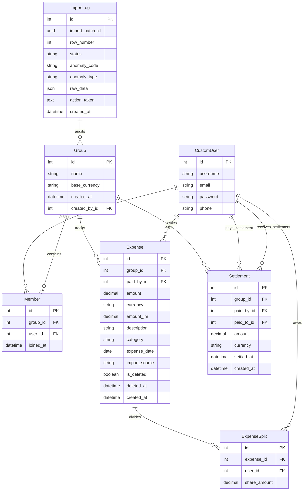

# Project Scope & Anomaly Log

This document details the data anomaly auditing policies and the relational database schema configured for the Shared Expense Tracker.

---

## 📋 Anomaly Log: CSV Data Problems & Policies

We identified 12 deliberate data anomalies in the CSV transaction sheets and implemented strict handling policies:

| Code | Anomaly | Condition / Logic | Handling Policy |
| :--- | :--- | :--- | :--- |
| **ANO-001** | `DUPLICATE_ROW` | SHA-256 hash of `(payer_email + amount + date + description)` matches a previously processed row in the batch or active DB records. | **SKIP** the row to prevent double-charging. Log as `SKIPPED` in `ImportLog`. |
| **ANO-002** | `CURRENCY_MISMATCH` | Row currency is different from the group base currency (e.g., USD or EUR vs INR). | **CONVERT** using rate table (USD: 83.5, EUR: 90.2) to base currency. Log warning and track original + converted amounts. |
| **ANO-003** | `SETTLEMENT_AS_EXPENSE` | Description contains keywords: `settled`, `paid back`, `reimbursed`, `cleared`, `transfer`, `returning`. | **RECLASSIFY** as a `Settlement` (paid_by is sender, first split participant is receiver). Exclude from group expenses. |
| **ANO-004** | `MISSING_REQUIRED_FIELD` | `payer_email`, `amount`, or `date` is blank or invalid. | **REJECT** the row with an error. Do not write to ledger. Log as `ERROR` with field details. |
| **ANO-005** | `FUTURE_DATED` | Transaction date is greater than the current local date. | **IMPORT** the transaction but flag a `WARNING` audit log for user awareness. |
| **ANO-006** | `MEMBERSHIP_CONFLICT` | Participant email listed in splits is not a member of the group. | **AUTO-JOIN** the user to the group to preserve transaction integrity. Log warning. |
| **ANO-007** | `NEGATIVE_AMOUNT` | Numeric amount is less than or equal to `0.00`. | **REJECT** the row. Negative values are treated as malformed inputs, not refunds. |
| **USER_NF** | `USER_NOT_FOUND` | Payer or participant email does not exist in the application database. | **REJECT** the row with an error. Database foreign keys require valid user profiles. |
| **REMAIND** | `DIVISION_REMAINDER` | Decimal splitting yields fractional pennies (e.g., ₹100.00 / 3 = 33.3333). | **REDISTRIBUTE** remainder. Quantize split shares to 2 decimal places, and assign the remainder to the first split participant. |
| **SOFT_DEL** | `SOFT_DELETED_INCLUSION` | Active balance calculations include soft-deleted expenses. | **FILTER OUT** soft-deleted records (`is_deleted=True`) from flow-minimization and user balance computations. |
| **PAYER_MC** | `PAYER_MEMBERSHIP_CONFLICT` | The paying user is not a member of the group. | **AUTO-JOIN** the payer to the group and import the transaction, flagging warning `ANO-006`. |
| **CASE_SNS** | `HEADER_CASE_INSENSITIVITY` | Column headers have varying casings or spaces (e.g. `Payer Email` or `paid_by`). | **NORMALIZE** headers by trimming whitespaces and converting them to lowercase during initial stream parsing. |

---

## 🗄️ Relational Database Schema

The database is built on **Neon PostgreSQL** with 7 tables:

